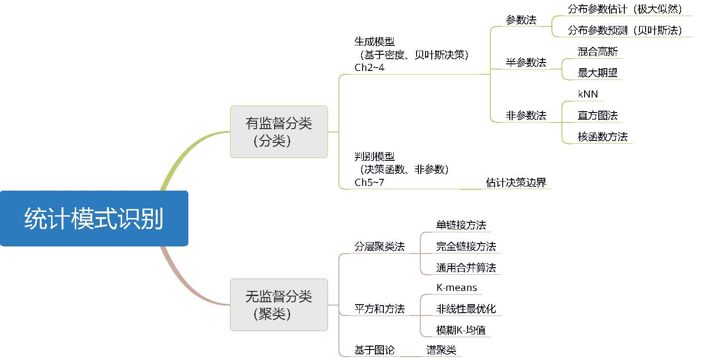
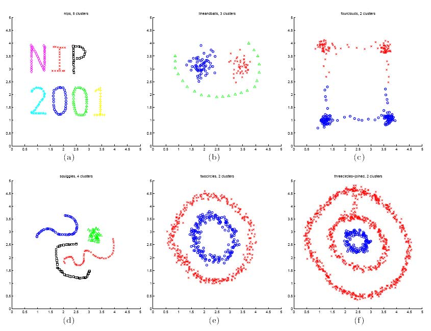

## 文献清单
[1] A. Webb, Statistical Pattern Recognition, 3rd edn, Wiley, 2011.
Chapter 1, Chapter 2, Chapter 4, Chapter 11.

[2] U. von Luxburg, A tutorial on spectral clustering, Statistics and Computing, 17(4): 395-416, 2007.

## 内容简介

模式识别问题的本质是分类问题，通常分为有监督分类（分类）和无监督分类（聚类）。

有监督分类主要研究的问题是对于每个样本点$\boldsymbol{x}$，将其归入正确的类别中。归类的依据可以从概率的角度，基于每个类的样本分布，计算新样本点属于每一类的概率，再讲该样本点归入可能性最大的一类；或直接根据使用数据来对不同类的决策边界来进行估计，而不需要计算概率密度。前者是基于概率密度的密度估计的生成模型的方法，后者属于判别模型的方法。

### 有监督分类

在文献[1]中，第2-4章讲述借助贝叶斯准则和对类条件密度函数的估计进行有监督分类的基本方法。第2章介绍基于正态分布的模型，第3章论述了模型参数可以使不确定的分类模型，第4章研究密度估计的非参数方法。在第5-7章讲述了有监督分类的判别模型的方法。

* 参数法/半参数法

在参数法密度估计中，实际应用时在已知先验知识 $p(\boldsymbol{\omega}_i)$ ，但往往密度函数 $p(\boldsymbol{x} \vert\boldsymbol{\omega}_i )$ 无法完全知晓。因此需要通过估计类条件密度函数再利用Bayes规则来构造判别规则。途径是假定密度函数是一个简单的参数模型，使用数据集估计该模型的参数。

最常见和广泛的模型选择为高斯模型:

$$p(x|\mu ,\sigma^2)=N(x;\mu ,\sigma^2)={\frac  {1}{{\sqrt  {2\pi \sigma ^{2}}}}}\,exp({{-{\frac  {(x-\mu )^{2}}{2\sigma ^{2}}}}})$$

多元正态高斯分布为：

$$p(\boldsymbol{x}|\boldsymbol{\mu} ,\boldsymbol{\Sigma})=N(\boldsymbol{x};\boldsymbol{\mu} ,\boldsymbol{\Sigma})={\frac  {1}{{ {(2\pi)^{d/2} |\boldsymbol{\Sigma_j}| ^{1/2}}}}}\,exp[{-{\frac{1}{2}  (x-\boldsymbol{\mu} )^T {\boldsymbol{\Sigma} ^{-1}}(x-\boldsymbol{\mu} )}}]$$

插入估计，将均值（$\boldsymbol{\mu}$）和协方差矩阵（$\boldsymbol{\Sigma}$）的估计带入判别函数，可得到高斯分类器从而对数据进行分类。在协方差矩阵估计为奇异矩阵时，可采用朴素贝叶斯、线性判别函数、投影子空间等方法来解决。

对于非高斯模型使用有限混合模型的方法来进行模拟，其分布形式如下，使用期望最大化算法进行参数估计。

$$p(\boldsymbol{x})=\sum_{j=1}^g \pi_j p(\boldsymbol{x};\boldsymbol{\theta}_j)$$

* 非参数法
在无法利用一定参数来刻画密度函数是，需要采样非参数的方法进行密度估计。

非参数的密度估计不需要规定密度函数的结构形式，方法包含：kNN、直方图法、基于核函数的方法、基函数展开方法和copulas方法。

### 无监督分类

无监督分类，即聚类，其目的是最优地将给定数据集划分为多个子类。所研究的问题的本质是相同类样本之间的相似度和不同类样本之间的相异性，涉及到两个主要的问题是距离度量和聚类数。

在文献[1]中，第11章介绍了在相异程度矩阵和个体的特征向量上的聚类方法。在方法上，聚类可以分为分层聚类法、平方和法和基于图论的方法。分层聚类法包括单链接方法、完全链接方法和同样合并算法。平方和方法包括K-means、非线性最优化和模糊K-均值。

在文献[2]中对基于图的谱聚类方法详细的介绍，Section 2-3分别介绍了算法的数学基础：相似图和图拉普拉斯矩阵，Section 4-7分别介绍了谱聚类算法及其三种解释，Section 8结合实际问题进行了相关讨论。相比较于分层聚类法和平方和方法，谱聚类往往性能更优，同时实施更简单，通过标准的线性代数的方法就能有效解决。

## 我的理解

直观上\textbf{模式识别}难以理解，“模式”一词更是在众多的领域都有不同含义。相比较于抽象的概念，找到其对应的物理意义或者空间构型相对更容易理解。以下是基于文献所述内容结合多维空间的数学思想对模式识别概念、分类聚类问题的理解。

在《统计模式识别》中，Webb将模式识别的主题归纳为“分类”，因此，模式识别的问题就是分类问题。

对每个样本 $\boldsymbol{x}$ 而言，其“模式”可以理解为描述该样本的各个参数 $(x_1,x_2,\dots,x_n)$的特征。对于每个属于$\boldsymbol{\omega}_i$类的样本$\boldsymbol{x}$ ，其“模式”（各参数）应符合一对应的特征。

有监督分类问题就可以表示为，已知每种参数特征以及其所对应的每一类 $\boldsymbol{\omega}_i$，$ i \in \left{1,\dots ,C\right}$；无监督分类问题就是将具有相同参数特征样本划分到同一类。

基于密度的生成模型，通过估计数据集样本的每个参数$(x_1,x_2,\dots,x_n)$ 的分布来构造分类模型，对新样本从概率角度判断每个参数所属的分布，从而完成对新样本的分类。判别模型可以将数据集视为在n维空间的点，在n维空间中，根据各个数据点的空间分布，利用超平面（决策边界）对不同类进行切分。新的样本点在n维空间中的位置，依据超平面划分的区域进行分类。

无监督分类的方法中，谱聚类作为基于图论的方法，如下图所示，在参数的空间中各样本按照空间位置划分类。

谱聚类的主要思想是把所有的样本看做空间中的点，这些点之间可以用边连接起来。距离较远的两个点之间的边权重值较低，而距离较近的两个点之间的边权重值较高，通过对所有数据点组成的图进行切图，让切图后不同的子图间边权重和尽可能的低，而子图内的边权重和尽可能的高，从而达到聚类的目的。

