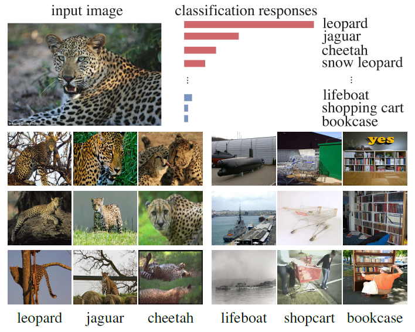
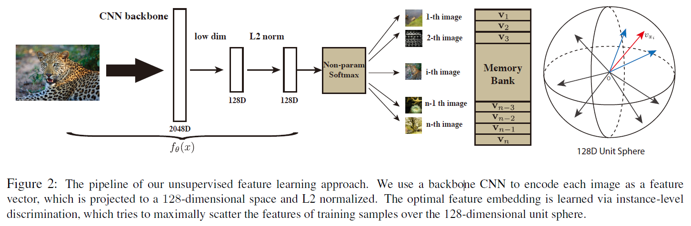

## 动机

神经网络分类器的训练需要有类别标记的数据，而网络的训练同时可以捕捉了视觉上的相似性，即使没有相关的任务约束。换句话说图片在视觉上的相似性并不是从给的标签的语义标注中学习到的，而是从图像数据本身。

取一种极端的例子：按照实例进行监督，即把每个实例看成一类。我们可以通过纯粹的判别学习来学习一个有意义的度量来反映实例之间明显的相似性吗?

如果我们在没有语义标注的情况下学习区分每个实例，那么我们最终可能会得到一个可以捕获实例间的视觉相似性的特征表示。

## 方法

目的是在没有监督信息的情况下学习到一个embedding函数
$$v=f_\theta (x)$$
其中$f_\theta$是参数为$\theta$的深度网络，将图像$x$映射到特征$v$。

这个embedding会在图像空间中引入一个度量
$$d_\theta(x,y)=||f_\theta(x)-f_\theta(y)||$$
一个好的embedding将把相似的图像映射到更靠近。

### 非参数softmax分类器
#### 参数化分类器
在实例水平使用softmax的参数化的分类目标函数。$x_1,\cdots,x_n$为n类n张图像，对于图像$x$，$v=f_\theta (x)$，被识别为第$i$类的概率为：
$$P(i|v)=\frac{exp(w_i^Tv)}{\sum_{j=1}^nexp(w_j^Tv)}$$

### 非参数分类器

参数化softmax的问题在于，权重向量是作为类别原型的，防止实例之间显式的比较。

作者提出了一种**非参数**的变式，使用$v_j^Tv$替代$w_j^Tv$，并通过L2正则化层约束$||v||==1$：
$$P(i|v)=\frac{exp(v_i^Tv/\tau)}{\sum_{j=1}^nexp(v_j^Tv/\tau)}$$
其中$\tau$是个温度参数，控制分布的浓度水平（？）

学习优化的目标就变成了在训练集上最大化联合概率分布或最小化负对数似然。
$$J(\theta)=-\sum_{i=1}^nlogP(i|f_\theta(x_i))$$

### Noise-Contrastive Estimation

当类数n很大时，计算非参数softmax代价高昂。作者使用NCE来降低计算量。

其基本思想是将多类分类问题转换为一组二分类问题，二分类的任务是区分数据样本和噪声样本。

存储库中的特征表示v对应于模型下的第i个例子的概率为：

$$P(i|v)=\frac{exp(v_i^Tf_i/\tau)}{Z_i}$$

$$Z_i=\sum_{j=1}^nexp(v_j^Tf_i/\tau)$$

$Z_i$是标准化常数。将噪声分布视为均匀分布$P_n=1/n$。

假设噪声样本是数据样本的m倍，则样本i对应特征v为来自数据分布(记为D = 1)的后验概率为:
$$h(i,v):=P(D=1|i,v)=\frac{P(i|v)}{P(i|v)+mP_n(i)}$$

将训练的优化近似为最小化噪声和数据样本的负对数后验分布：
$$J_{NCE}(\theta)=-E_{P_d}[log~h(i,v)]-m\cdot E_{p_n}[log~(1-h(i,v'))]$$
其中$P_d$表示了真实的数据分布，$v$是对应$x_i$的特征。而$P_n$则对应噪声分布，$v'$是来自其他图像的特征，图像随机从噪声分布中采样。$v'$和$v$都是从非参数存储库中采样的。

计算$Z_i$代价高昂，考虑$Z_i$是一个常量，使用蒙克卡罗方法估计其近似值。

NCE将每个样本的计算复杂度从$O(n)$降低到$O(1)$。

### Proximal Regularization

在每个训练时期，每个类只访问一次。因此，学习过程中随机抽样波动很大。

作者采用Proximal optimization近端优化的方法，并引入了额外项来促进训练过程的平滑。

最终的目标函数：
$$J_{NCE}(\theta)=-E_{P_d}[log~h(i,v_i^{(t-1)})-\lambda ||v_i^{(t)}-v_i^{(t-1)}||^2_2]\\-m\cdot E_{p_n}[log~(1-h(i,v'^{(t-1)}))]$$

### 加权的kNN分类器
为了分类测试样本$\hat{x}$，首先计算$\hat{f}=f_\theta(\hat{x})$，接着与存储库中的各个embedding特征进行对比，使用余弦相似度。选择前k个近邻:$N_k$，将被用来通过加权投票进行预测。